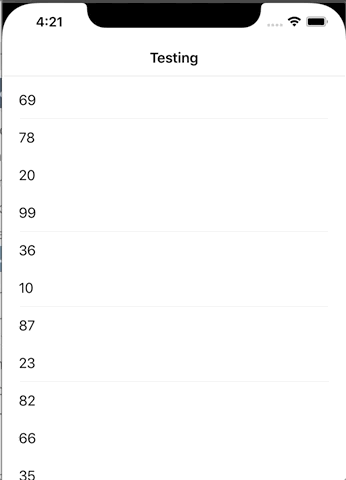

# SwiftUI-PullToRefresh

Pull to refresh implementation in SwiftUI for **List and NavigationView**

This article helped me a lot: https://swiftui-lab.com/scrollview-pull-to-refresh/
Thanks!


## Installation: 

It requires iOS 13 and xCode 11!

In xCode got to `File -> Swift Packages -> Add Package Dependency` and paste inthe repo's url: `https://github.com/phuhuynh2411/SwiftUI-PullToRefresh.git`  

## Usage: 
You need to add `RefreshableNavigationView(title: String, action: () -> Void, content: () -> View)` to your View. Title is the navigationView title, and the action takes the refresh function. RefreshableNavigationView already encapsulates a List() so in the content you only need to define your cells. If you want TableViewCellSeparators don't forget to add a `Divider()` at the bottom of your cell.

Example: 

```swift
struct ContentView: View {
    @State var numbers:[Int] = [23,45,76,54,76,3465,24,423]
    @State var showRefreshView: Bool = false
    
    var body: some View {
        RefreshableNavigationView(title: "Testing", showRefreshView: $showRefreshView, displayMode: .inline, action:{
            self.numbers = self.generateRandomNumbers()
            // Remember to set the showRefreshView to false
            DispatchQueue.main.asyncAfter(deadline: .now() + 3) {
                self.showRefreshView = false
            }
        }){
            ForEach(self.numbers, id: \.self){ number in
                VStack(alignment: .leading){
                    Text("\(number)")
                    Divider()
                }
            }
        }
    }
    
    func generateRandomNumbers() -> [Int] {
        var sequence = [Int]()
        for _ in 0...30 {
            sequence.append(Int.random(in: 0 ..< 100))
        }
        return sequence
    }
}
```

## Support Inline Navigation Bar
Change the displayMode to .inline if you want to display the list like below.



```swift
RefreshableNavigationView(title: "Testing", showRefreshView: $showRefreshView, displayMode: .inline, action:{
    self.numbers = self.generateRandomNumbers()
    // Remember to set the showRefreshView to false
    DispatchQueue.main.asyncAfter(deadline: .now() + 3) {
        self.showRefreshView = false
    }
}){
    ForEach(self.numbers, id: \.self){ number in
        VStack(alignment: .leading){
            Text("\(number)")
            Divider()
        }
    }
}
```

## Use without NavigationView
In some cases, you want to add the pull to refresh to the List without the NavigationView. Here you go. Just need to add the RefreshableList like below. Make sure to set the displayMode = .inline. The .large does not work without the NavigationView.


```swift
struct ContentView: View {
    @State var numbers:[Int] = [23,45,76,54,76,3465,24,423]
    @State var showRefreshView: Bool = false
    
    var body: some View {
        RefreshableList(showRefreshView: $showRefreshView, action:{
                    self.numbers = self.generateRandomNumbers()
                    // Remember to set the showRefreshView to false
                    DispatchQueue.main.asyncAfter(deadline: .now() + 3) {
                        self.showRefreshView = false
                    }
                }){
                    ForEach(self.numbers, id: \.self){ number in
                        VStack(alignment: .leading){
                            Text("\(number)")
                            //.padding()
                            Divider()
                        }
                    }
                }
    }
    
    func generateRandomNumbers() -> [Int] {
        var sequence = [Int]()
        for _ in 0...30 {
            sequence.append(Int.random(in: 0 ..< 100))
        }
        return sequence
    }
}
```

## Use with NavigationView
The RefreshableList can be embeded in the NavigationView.

```swift
NavigationView {
    RefreshableList(showRefreshView: $showRefreshView, action:{
        // your refresh code
        // Remember to set the showRefreshView to false
        self.showRefreshView = false
    }){
        ForEach(self.numbers, id: \.self){ number in
            VStack(alignment: .leading){
                Text("\(number)")
                Divider()
            }
        }
    }
    .navigationBarTitle("Testing", displayMode: .inline)
}
```

## Perform an action when scrolling to the last row
Sometimes, you prefer to perform an action when scrolling to the last row e.g. loading more data. You can do that by adding the following function

```swift
.onLastPerform {
// add your method here
}
```
Here is an example.
```swift
RefreshableList(showRefreshView: $showRefreshView, action:{
    self.numbers = self.generateRandomNumbers()
    // Remember to set the showRefreshView to false
    DispatchQueue.main.asyncAfter(deadline: .now() + 3) {
        self.showRefreshView = false
    }
}){
    ForEach(self.numbers, id: \.self){ number in
        VStack(alignment: .leading){
            Text("\(number)")
            Divider()
        }
    }
}
.onLastPerform {
    // Add your method here.
}
```
